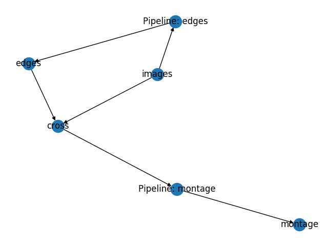

# Pachplot - visualise Pachyderm DAGs

Pachplot is a crude visualisation tool for [Pachyderm](https://pachyderm.io/) DAGs.

This is work in progress... YMMV!

## Dependencies

- The pachyderm Python bindings
- NetworkX
- Matplotlib

## Usage

- `pachctl port-forward`
- `python pachplot.py`

Now if you had followed the [beginner's tutorial](https://docs.pachyderm.com/latest/getting_started/beginner_tutorial/), you should see this:

